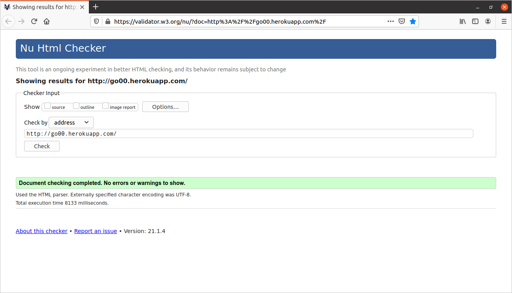
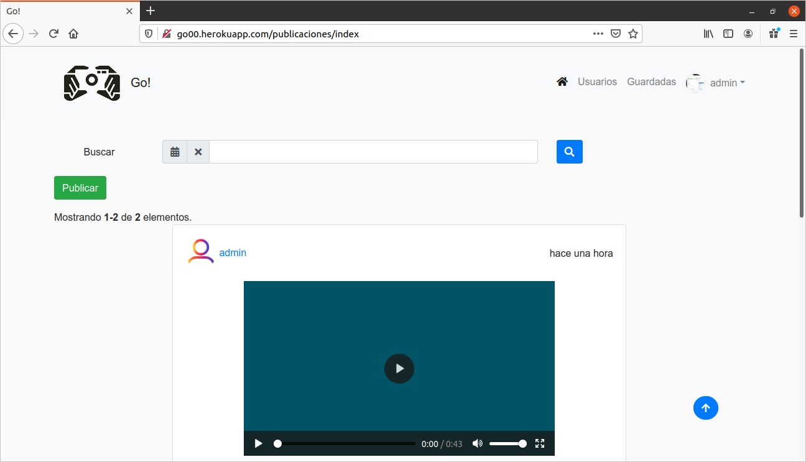
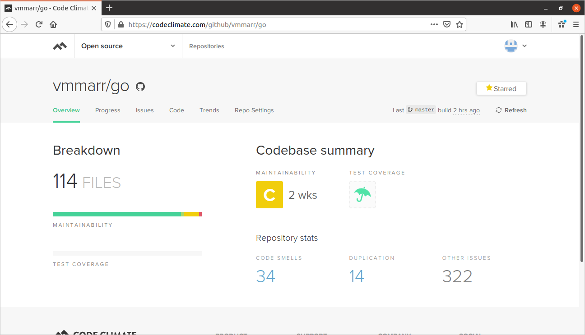
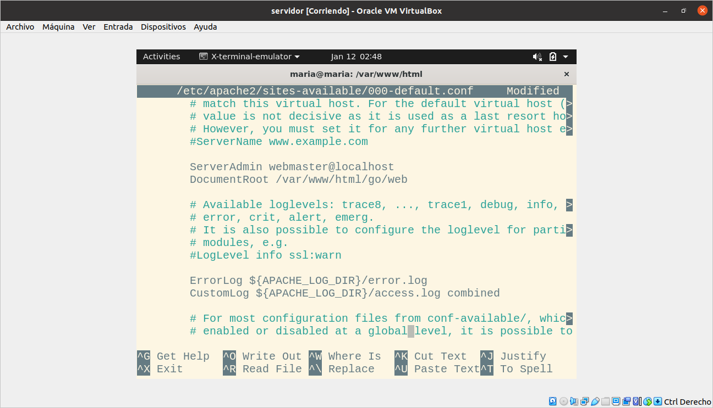
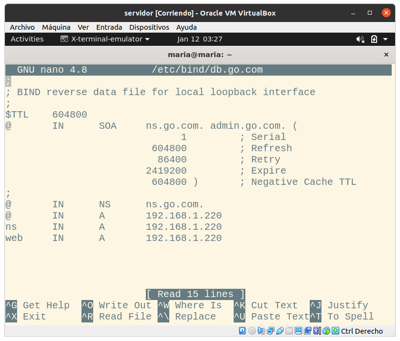

# Anexos

### **(R34) Validación de HTML y CSS, nivel de accesibilidad AA y prueba del seis**
---
### Validación de HTML y CSS

**HTML**

**CSS**

---

### Validación de accesibilidad

Los errores que se observan son derivados del bootstrap

---

### Prueba del seis

 1. ¿Qué sitio es éste?
- La aplicación tiene elementos indicativos que te muestra de que sitio es. Arriba en la menú de navegación está en todo momento el logotipo de la aplicación. El menú de navegación se mantiene siempre, por lo que siempre está identificado el sitio.

 2. ¿En qué página estoy?
- Todas las páginas del sitio están identificadas por las migas de pan que te sitúan en todo momento.

 3. ¿Cuales son las principales secciones del sitio?
- Las principales secciones del sitio son *Publicaciones*, *Comentarios*, *Likes*, *Seguidores* y *Seguidos*(algunas secciones solo serán visibles si estamos logueados en la aplicación).

 4. ¿Qué opciones tengo en este nivel?
- Aparte de las secciones descritas antes, en la barra de navegación a la derecha hay dos secciones, una de *Usuarios* y otra de *Guardadas*.

 5. ¿Dónde estoy en el esquema de las cosas?
- En todas las páginas existe en la zona superior un indicador de bloque con las migas de pan.

 6. ¿Cómo busco algo?
- Solo es posible buscar una publicacion por la fecha de creacción en la vista de index de las publicaciones y a un usuario tanto por nombre como por username en la vista de usuarios.

---

### **(R36) Comprobación en varios navegadores**

#### **Google Chrome**

---

#### **Mozilla Firefox**

---

#### **Opera**

---

## **(R26) Code Climate**

---

## **(R38) Despliegue en servidor local**

### Configuración apache:

### Activar SSL
``$ sudo a2enmod ssl``

``$ sudo a2ensite default-ssl``

``$ sudo openssl genrsa -des3 -out server.key 2048``

`` sudo openssl req -new -key server.key -out server.csr``

``$ sudo openssl x509 -req -days 365 -in server.csr -signkey server.key -out server.crt``

``$ sudo cp server.crt /etc/ssl/certs/``

``$ sudo cp server.key /etc/ssl/private/``

``$ sudo service apache2 restart``

### Configuración de Red:

### Configuración DNS

named.conf.local

db.go.com

