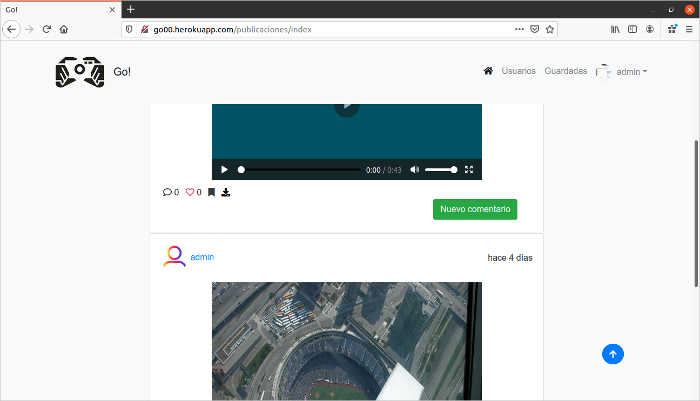
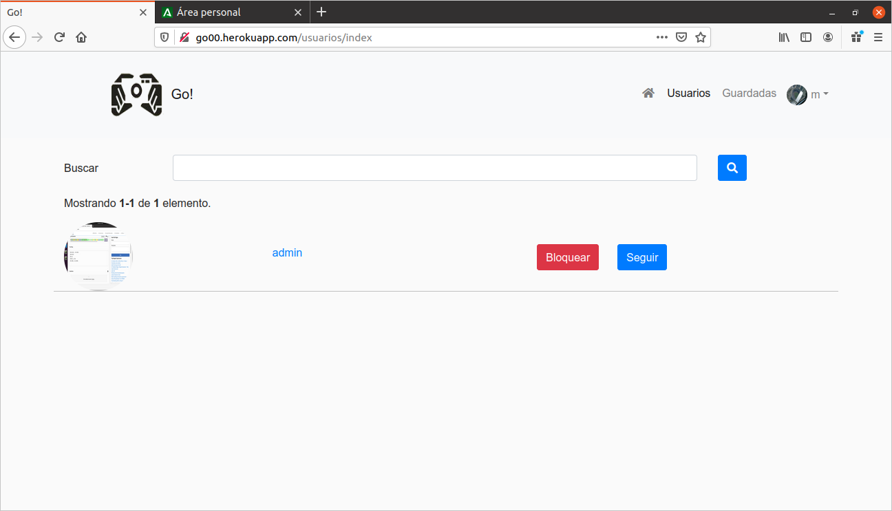
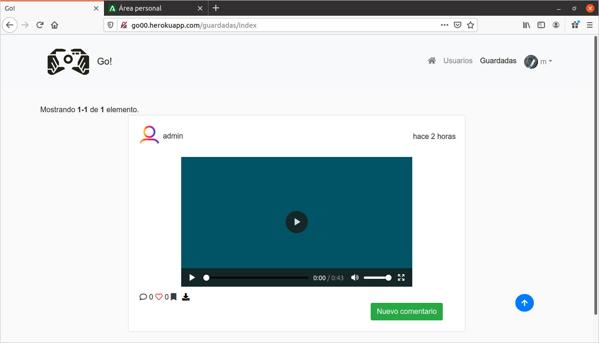
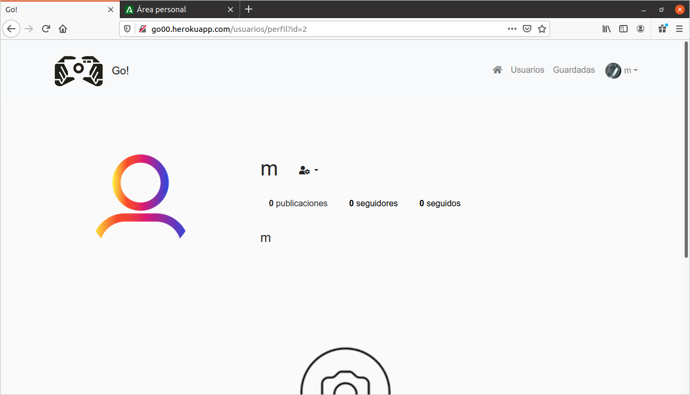
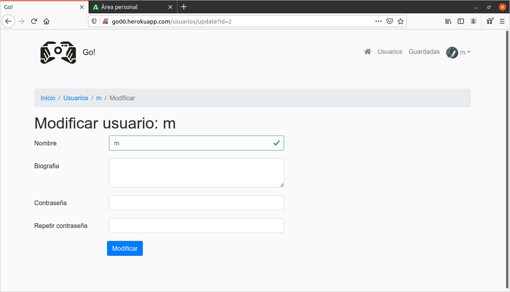
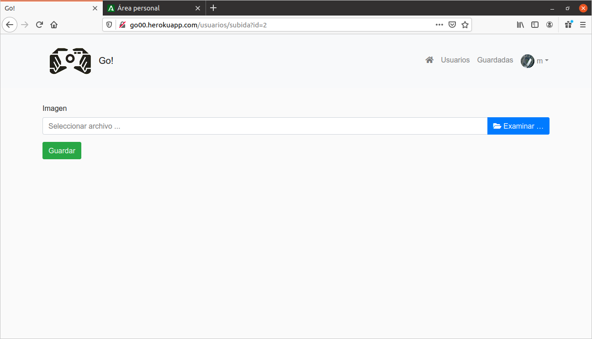

# Manual de usuario

Al entrar en la aplicación veremos una pantalla como esta:

En esta pantalla vamos a poder iniciar sesión, registrarnos o recuperar contraseña.

Una vez iniciamos sesión nos aparecerá una pantalla como esta:

En esta pantalla vamos a ver todas las publicaciones  publicadas por otros usuarrios, podemos buscar una publicacion por una fecha, comentar, dar like, descargar y guardar una publicación.
Tambien nos muestra al pie de cada publicacion los 2 ultimos comentarios, para ver todos los comentarios debemos pulsar sobre el icono de comentario.
Para ver todos los likes tenemos que pulsar en el + de al lado del corazon (aparecera si hay like)

Los iconos nos permitirán hacer lo siguiente:
- Comentario: abre un modal que lista todos los comentarios.
- Like: dar o quitar like.
- Marcador: guarda una publicacion.
- Descargar: descarga una publicacion.

En el apartado usuarios veremos todos los usuarios registrados en la aplicacion, podremos bscar un usuario tanto por su nombre como por su username.
Podemos bloquear un usuario.
Podemos seguir a un usuario.

En el apartado guardadas aparecerán las publicaciones que hemos guardado con anterioridad.

En el dropdown tendremos dos opciones una sera para ver nuestro perfil y la otra para desloquearnos.

Si le damos a la opcion de Mi perfil veremos lo siguiente:

Si hacemos clic en el dropdown de user-cog tendremos la opcion de editar perfil, subir foto de perfil o borrar un usuario.

